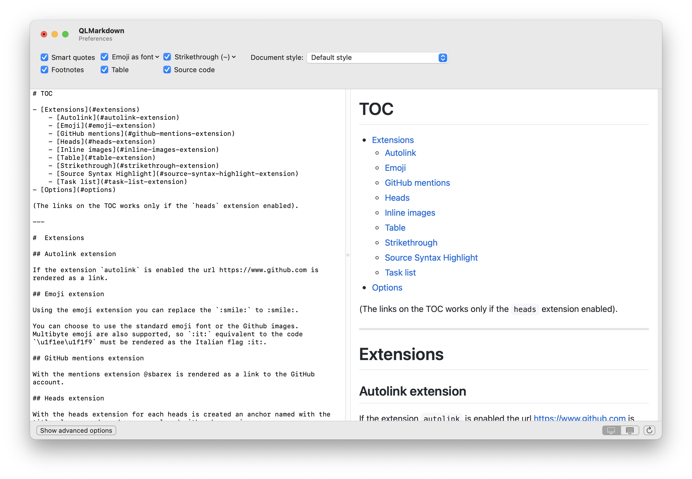

#  Quicklook extension for markdown files


This app provide a quicklook extension to handle markdown files from macOS 10.15 onwards.

**The software is provided "as is", without any warranty of any kind.**

You can download the last compiled release (as universal binary) from [this link](https://github.com/sbarex/QLMarkdown/releases). 



To use the quicklook preview you must launch the application at least once. In this way the quicklook extension will be discovered by the system. 
After the first execution, the quicklook extension will be available (and enabled) among those present in the System preferences/Extensions.

For maximum compatibility with the markdown format, the [`cmark-gfm`](https://github.com/github/cmark-gfm) library is used. The library is a GitHub fork of the standard cmark tool to process the markdown files. 

Compared to the standard `cmark-gfm` equipment, these extensions have been added:
- `Emoji`: translate the emoji placeholders like ```:smile:```.
- `Heads`: create anchors for the heads.
- `Source code`: highlight the code inside fenced block.
- `Inline local images`: embed the image files inside the formatted output (required for the quicklook preview).

From the Preferences window you can configure the options, enable the desired extensions and set the style.

## Options
The options follow those offered by the `cmark-gfm`:
- `hard break` _(available on advanced options panel)_: Render `softbreak` elements as hard line breaks.
- `no soft break` _(available on advanced options panel)_: Render `softbreak` elements as spaces.
- `unsafe raw HTML` _(available on advanced options panel)_: Render raw HTML and unsafe links (`javascript:`, `vbscript:`,  `file:`, and `data:`, except for `image/png`, `image/gif`,  `image/jpeg`, or `image/webp` mime types).  By default, raw HTML is replaced by a placeholder HTML comment. Unsafe links are replaced by empty strings.
- `validate UTF` _(available on advanced options panel)_: Validate UTF-8 in the input before parsing, replacing illegal sequences with the replacement character U+FFFD.
- `smart quotes`: Convert straight quotes to curly, ```---``` to em dashes, ```--``` to en dashes.
- `footnotes`: Parse the footnotes.

## Extensions
- `Autolink` _(available on advanced options panel)_: automatically translate url to link.
- `Emoji`: parse the emoji placeholder defined by GitHub. You can render the emoji with an emoticons glyph or using the image provided by GitHub. It is possible that some placeholders (especially if they require a sequence of several unicode codes) are not supported by the system font.
- `GitHub mentions` _(available on advanced options panel)_: translate mentions to link to the GitHub account.
- `Heads _(available on advanced options panel)_`: create anchors for the heads to use as cross internal reference. Each anchor is named with the title of the caption, lowercased, with spaces replaced with a dash char (`-`). UTF8 character encoding is supported.
- `Inline local images` _(available on advanced options panel)_: inject in the html code the local images as base64 data. The quick look extension can not access to the local images defined inside the markdown code, so embedding the data it's a way around the limitation. For security reasons are handled only urls without schema (e.g. `./image.jpg` or `image.jpg`), or with the `file` schema (e.g.  `file:///Users/username/Documents/image.jpg`) referring to existing files with an image mime type. This extension is required to render local images inside the quicklook preview. 
- `Source code`: highlight the source code inside a fenced box. 
- `Strikethrough`: strikethrough text inside tildes. You can choose to detect single or double tilde delimiters.
- `Table`: parse table as defined by the GitHub extension to the standard markdown language.
- `Tag filter` _(available on advanced options panel)_: strip potentially dangerous html tags (`<title>`,   `<textarea>`, `<style>`,  `<xmp>`, `<iframe>`, `<noembed>`, `<noframes>`, `<script>`, `<plaintext>`).
- `Task list` _(available on advanced options panel)_: parse task list as defined by the GitHub extension to the standard markdown language.

### Emoji extension
This extension translate the placeholders defined by [GitHub](https://api.github.com/emojis) into the corresponding emoji. 
It is possible to translate with the system emoji font or using the image provided by GitHub (internet connection required). 

Multibyte emoji are supported, so `:it:` equivalent to the code `\u1f1ee\u1f1f9` must be rendered as the Italian flag :it:. Some multibyte sequence may not be supported by the system font, in this case it is recommended to set the substitution with GitHub images.

A list of GitHub emoji placeholder is available [here](https://github.com/ikatyang/emoji-cheat-sheet/blob/master/README.md#people--body)

### Inline local images extension
This extension is required only to render local images on the quicklook preview. You can enable/disable from the advanced options panel.

For security reason the quicklook preview (based on an html view) do not load local files. During the rendering process, the extension then embed the contents of the file on the html code as a base64 encoded data. This process operate only on local images (url without a scheme or with the `file://` scheme and with image mime type).
With the `file://` scheme you *always set the fullpath*. For images inside the same folder of the markdown file do not use the scheme  `file://` and also `./` is optional.

### Source code highlight extension
This extension highlight the source code inside a fenced box.

The rendering engine is based on the [Highlight](http://www.andre-simon.de/doku/highlight/en/highlight.php). No external program is called, the engine is embedded in a library.

In the advanced options panel you can customize the settings:

- Theme (for light and dark appearance).
- Line numbers visibility.
- Word wrap options.
- Use spaces instead of tabs for indentation.
- Font.
- Guess undefined language.

Some themes (especially those for light appearance) uses a white background that is the same of the markdown document, making the code block not immediately recognizable. For this reason it is possible to override the theme background color in order to use a personal one or the one defined by the markdown document. It is also possible to customize the theme used for language highlighting as desired. 

Setting a custom font also change the font used in the code blocks enclosed by back-ticks (\`).

When the code block does not specify the language it is possible to activate a guessing function. Two engines are available:

- Fast guess: it is based on the `magic` library;
- Accurate guess: it is based on the [`Enry`](https://github.com/go-enry/go-enry) library, that is a golang porting of the ruby [`linguist`](https://github.com/github/linguist/) library used by GitHub.

If no language is defined and the guessing fail (or is not enabled), the code is rendered as normal text.


#### Source code highlight styles editor

TODO

# Style
You can choose a css theme to render the markdown file. The app is provided with a predefined theme valid both for light and dark theme. 

Also it is possible to use a style to extend the standard theme or to complete override. 
User customized style sheet must have the settings for both light and dark appearance using the css media query:

```css
@media (prefers-color-scheme: dark) { 
    /* … */ 
}
``` 

The custom style is appended after the css used for the source code. In this way you can customize also the style of the language code. 

# Build from source

When you clone this repository, remember to fetch also the submodule with `git submodule update --init`.

## Dependency

The app uses an extra library `highlight wrapper`. This is a custom c++ shared library that expose the `highlight` functionality, emoji replacement and the guess detection engines. All the code required by this library is included in the Xcode project, and is compiled as a universal library. 

The wrapper has statically linked the following libraries:
- [`highlight`](http://www.andre-simon.de/doku/highlight/en/highlight.php) for source code highlight,
- [`lua`](https://www.lua.org/) required by `highlight`
- [`magic`](https://www.darwinsys.com/file/), used to guess the source code language when the guess mode is set to _fast_.
- [`Enry`](https://github.com/go-enry/go-enry), used to guess the source code language when the guess mode is set to _accurate_.

Because `Enry` is developed in `go`, to build the wrapper library you must have the `go` compiler installed (you can use `brew install go`). 

# Note about security

To allow the quicklook view of local images the application and the extension has an entitlement exception to allow *only read access* to the entire system. 

On Big Sur there is a bug in the quicklook engine and webkit that cause the immediate crash of any WebView inside a quicklook preview. To temporary fix this problem this quicklook extension uses a `com.apple.security.temporary-exception.mach-lookup.global-name` entitlement. 


# Difference with the GitHub markdown engine

The parsing process is based on the GitHub [`cmark-gfm`](https://github.com/github/cmark-gfm) library.

The main difference is in the choice of style sheet and in the formatting of the source code.
GitHub uses a number of libraries in Ruby for parsing and formatting source code that cannot easily be converted into a compiled library.

The accurate engine for the language detection (used however only when the language is not specified) is a library derived from the `linguistic` framework used by GitHub.

The source code highlight is based to a different library, so the formatting, style, and token recognition of the language is potentially different.


# Note about the developer

I am not primarily an application developer, and I have no particular experience in programming in swift and much less in c/c++. There may be possible bugs in the code, be patient.
Also I am not a native English speaker :sweat_smile:. 

**This application was developed for pleasure.**

Thanks to thanks to [hazarek](https://github.com/hazarek) for the app icon and the css style. 


