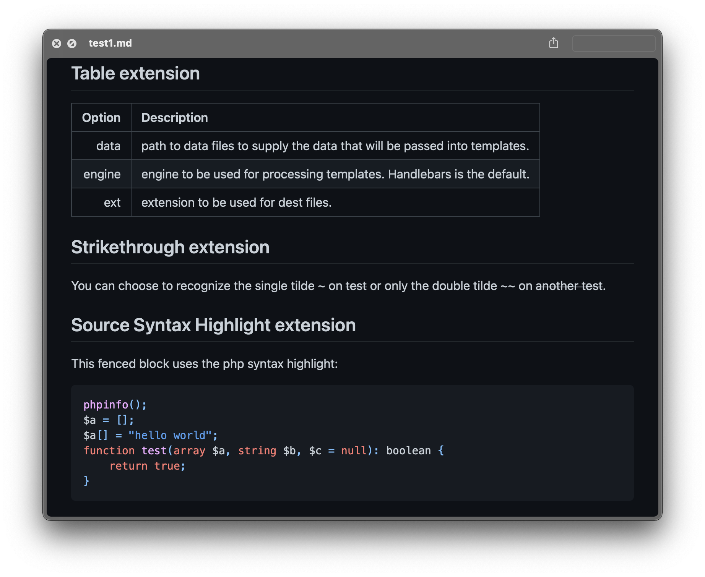
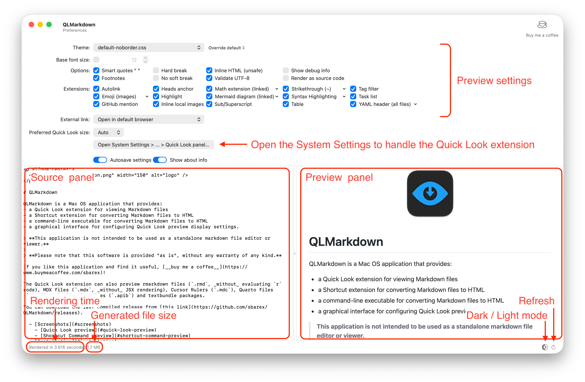
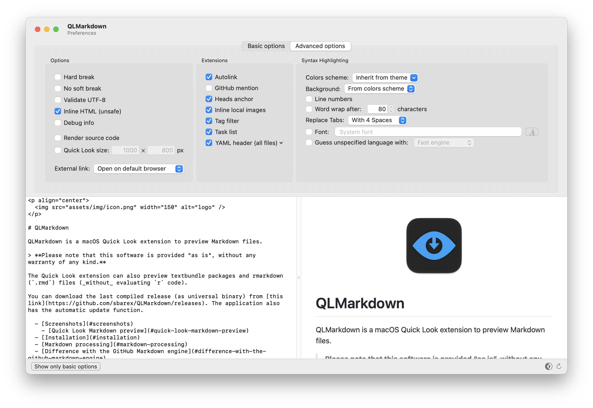

[](https://github.com/sbarex/QLMarkdown/releases) [](https://github.com/sbarex/QLMarkdown/releases)

<p align="center">
  
</p>

# QLMarkdown

QLMarkdown is a macOS Quick Look extension to preview Markdown files. 

_This application is not intended to be used as a standalone markdown file editor or viewer._ 

> **Please note that this software is provided "as is", without any warranty of any kind.**

The Quick Look extension can also preview rmarkdown (`.rmd`) files (_without_ evaluating `r` code), Quarto files (`.qmd`) and textbundle packages.

You can download the last compiled release (as universal binary) from [this link](https://github.com/sbarex/QLMarkdown/releases). 

  - [Screenshots](#screenshots)
    - [Quick Look Markdown preview](#quick-look-markdown-preview)
  - [Installation](#installation)
  - [Markdown processing](#markdown-processing)
  - [Difference with the GitHub Markdown engine](#difference-with-the-github-markdown-engine)
  - [Settings](#settings)
    - [Themes](#themes)
    - [Basic options](#basic-options)
    - [Advanced options](#advanced-options)
    - [Extensions](#extensions)
      - [Emoji](#emoji)
      - [Inline local images](#inline-local-images)
      - [Syntax Highlighting](#syntax-highlighting)
      - [YAML header](#yaml-header)
  - [Command line interface](#command-line-interface)
  - [Build from source](#build-from-source)
    - [Dependency](#dependency)
  - [Note about security](#note-about-security)
  - [Note about the developer](#note-about-the-developer)


## Screenshots


### Quick Look Markdown preview




## Installation

You can download the last compiled release (as universal binary) from [this link](https://github.com/sbarex/QLMarkdown/releases) or you can install the Application with [Homebrew](https://brew.sh/):   

```shell
brew install --cask qlmarkdown
```

The application has the automatic update function.

To use the Quick Look preview you must launch the application at least once. In this way the Quick Look extension will be discovered by the system. 
After the first execution, the Quick Look extension will be available (and enabled) among those present in the System preferences/Extensions.

If you have problems, try moving the application to the trash and then back in the Applications folder. 
If the `QLMarkdown Preview Extension` is present (and checked) in the list of Quick Look Extensions in the System preferences but the `.md` files are not displayed it is probably due to other applications that have registered support for that type of file. You can change the order of priority of the Quick Look Extensions inside the System preferences.

Finally, the problems may depend on how the `.md` files were registered on the system by other applications.

In the terminal try the following command:

```shell
mdls -name kMDItemContentType PATH_OF_AN_EXISTS_MD_FILE
```

The output is the UTI associated with the `.md` file.

This application handle these UTIs:
- `com.rstudio.rmarkdown`
- `com.unknown.md`
- `net.daringfireball.markdown`
- `net.ia.markdown`
- `org.quarto.qmarkdown`
- `public.markdown`
- `org.textbundle.package`
- `dyn.ah62d4rv4ge8043a` (dynamic UTI for unassociated .md files)
- `dyn.ah62d4rv4ge81e5pe` (dynamic UTI for unassociated .rmd files)
- `dyn.ah62d4rv4ge81c5pe` (dynamic UTI for unassociated .qmd files)

Please inform me of any other UTI associated to `.md` files.


## Markdown processing

For maximum compatibility with the Markdown format, the [`cmark-gfm`](https://github.com/github/cmark-gfm) library is used. The library is a GitHub fork of the standard cmark tool to [process the Markdown files](https://github.github.com/gfm/). 

Compared to the `cmark-gfm`, these extensions have been added:
- [`Emoji`](#emoji): translate the emoji placeholders like `:smile:` to :smile:.
- [`Heads anchors`](#heads-anchors): create anchors for the heads.
- [`Inline local images`](#inline-local-images): embed the image files inside the formatted output (required for the Quick Look preview).
- [`Syntax highlighting`](#syntax-highlighting): highlight the code inside fenced block.
- [`YAML header`](#yaml-header): render the yaml header at the begin of `rmd` or `qmd` files.


## Difference with the GitHub Markdown engine

Although GitHub has customized the [`cmark-gfm`](https://github.com/github/cmark-gfm) library, it does not use it directly in the rendering process of Markdown files (see [this repository](https://github.com/github/markup)).
GitHub uses a number of libraries in Ruby for parsing and formatting source code that cannot easily be converted into a compiled library.

The main difference between this application and GitHub is the formatting of the source code.
Syntax highlighting uses a different library, so the formatting, colors scheme, and language token recognition are potentially different.

This application, when set to use the accurate engine for the language detection (used only when the language is not specified) uses a library derived from the [`Linguistic`](https://github.com/github/linguist#syntax-highlighting) framework adopted by GitHub.


## Settings

Launching the application, you can configure the options, enable the desired extensions and set the theme for formatting the Quick Look preview of Markdown files.

__To make the settings effective you need to save them (`cmd-s` or menu `File` > `Save settings`) or enable the autosave option.__



The window interface has an inline editor to test the settings with a markdown file. You can open a custom markdown file and export the edited source code.

> Please note that this application is not intended to be used as a standalone markdown file editor or viewer but only to set Quick Look preview formatting preferences. No warning about unsaved markdown code is displayed when closing the application. 


### Themes

You can choose a CSS theme to render the Markdown file. The application is provided with a predefined theme derived from the GitHub style valid both for light and dark appearance. 

You can also use a style to extend the standard theme or to override it. 
User customized style sheet must have the settings for both light and dark appearance using the CSS media query:

```css
@media (prefers-color-scheme: dark) { 
    /* … */ 
}
``` 

The custom style is appended after the CSS used for the highlight the source code. In this way you can customize also the style of the syntax highlight. 

[Syntax highlighting extension](#syntax-highlighting) allow to customize the appearance of the code blocks.

The theme popup menu has some extra commands available pressing the `alt` key.


### Basic options

|Option|Description|
|:--|:--|
|Smart quotes|Convert straight quotes to curly, ```---``` to _em dashes_ and ```--``` to _en dashes_.|
|Footnotes|Parse the footnotes. Footnotes are not supported by GitHub.|
|Emoji|Enable the [Emoji extension](#emoji).|
|Table|Parse table as defined by the GitHub extension to the standard Markdown language.|
|Strikethrough|Strikethrough text inside tildes. You can choose to detect single or double tilde delimiters.|
|Syntax highlighting|Enable the [Syntax highlighting extension](#syntax-highlighting). On the adavanced options you can customize the formatting options.|


### Advanced options

Some lesser-used options are available in the advanced panel.



|Option|Description|
|:--|:--|
|Hard break|Render `softbreak` elements as hard line breaks.|
|No soft break|Render `softbreak` elements as spaces.|
|Validate UTF|Validate UTF-8 in the input before parsing, replacing illegal sequences with the standard replacement character (U+FFFD &#xFFFD;).|
|Inline HTML (unsafe)|Render raw HTML and unsafe links (`javascript:`, `vbscript:`,  `file:` and `data:`, except for `image/png`, `image/gif`,  `image/jpeg`, or `image/webp` mime types) present in the Markdown file. By default, HTML tags are stripped and unsafe links are replaced by empty strings. _This option is required for preview SVG images_.|
|Render source code|Shows the highlighted source code instead of the formatted output.|
|Debug info|Insert in the output some debug information.|

|Extension|Description|
|:--|:--|
|Autolink|Automatically translate URL to link and parse email addresses.|
|GitHub mentions|Translate mentions to link to the GitHub account.|
|<a name="heads-anchors"></a>Heads anchors|Create anchors for the heads to use as cross internal reference. Each anchor is named with the lowercased caption, stripped of any punctuation marks (except the dash) and spaces replaced with dash (`-`). UTF8 character encoding is supported.|
|Inline local images|Enable the [Inline local images extension](#inline-local-images).|
|Tag filter|Strip potentially dangerous HTML tags (`<title>`,   `<textarea>`, `<style>`,  `<xmp>`, `<iframe>`, `<noembed>`, `<noframes>`, `<script>`, `<plaintext>`). It only takes effect if the option to include HTML code is enabled.|
|Task list|Parse task list as defined by the GitHub extension to the standard Markdown language.|
|YAML header|Enable the [YAML header extension](#YAML-header).|

In the advanced options, you can also choose if open external link inside the Quick Look preview window or in the default browser.

The `Quick Look window` option allow you to force a custom size for the content area of the Quick Look window. _Use with caution on macOS before version 12 Monterey_.


### Extensions


#### Emoji

From the [Basic options panel](#basic-options) you can enable the Emoji extension to handle the placeholders defined by [GitHub](https://api.github.com/emojis). You can render the emoji with an emoticon glyph or using the image provided by GitHub (internet connection required). 

Multibyte emoji are supported, so `:it:` equivalent to the code `\u1f1ee\u1f1f9` must be rendered as the Italian flag :it:. 

Some emoji do not have an equivalent glyph on the standard font and will be replaced always with the relative image.

A list of GitHub emoji placeholder is available [here](https://github.com/ikatyang/emoji-cheat-sheet/blob/master/README.md#people--body).

 
### Inline local images 

In the [Advanced options panel](#advanced-options), you can enable the Inline image extension required to preview images within the Quick Look window by injecting the images as base64 data into the HTML code. The Quick Look extension, for security limitations, cannot access to the local images defined inside the Markdown code, so embedding the data it's a way around the limitation. 

For security reasons are handled only URLs without schema (e.g., `./image.jpg`, `image.jpg` or `assets/image.jpg`), or with the `file` schema (e.g.,  `file:///Users/username/Documents/image.jpg`) referring to existing files with an image mime type. 
With the `file://` schema you *must always set the full path*. For images inside the same folder of the Markdown file do not use the  `file://` schema and also the path `./` is optional.

The extension process both images defined in the Markdown syntax and also with HTML `` tag if the raw HTML code option is enabled.


#### Syntax Highlighting

This extension highlights the source code inside a fenced box.

The rendering engine is based on the [Highlight](http://www.andre-simon.de/doku/highlight/en/highlight.php) library. No external program is called, the engine is embedded in the app.

In the [advanced options panel](#advanced-options) you can customize the settings:

- Colors scheme (for light and dark appearance).
- Line numbers visibility.
- Word wrap options.
- Tabs replacements.
- Font.
- Guess engine for undefined languages.

Some colors scheme (especially those for light appearance) uses a white background that is the same of the Markdown document, making the code block not immediately recognizable. For this reason, it is possible to override the background color in order to use a personal one or the one defined by the Markdown theme. 

Setting a custom font also change the font used in the code blocks enclosed by back-ticks (\`).

When the code block does not specify the language, it is possible to activate a guessing function. Two engines are available:

- Fast guess: it is based on the `magic` library;
- Accurate guess: it is based on the [`Enry`](https://github.com/go-enry/go-enry) library, that is a Golang porting of the Ruby [`linguist`](https://github.com/github/linguist/) library used by GitHub.

If no language is defined and the guessing fail (or is not enabled), the code is rendered as normal text.


### YAML header

In the [Advanced options panel](#advanced-options), you can enable the extension to handle a `yaml` header at the beginning of a file. You can choose to enable the extensions to all `.md` files or only for `.rmd` and `.qmd` files.

The header is recognized only if the file start with `---`. The yaml block must be closed with `---` or with `...`.

When the `table` extension is enabled, the header is rendered as a table, otherwise as a block of code. Nested tables are supported.


## Command line interface

A `qlmarkdown_cli` command line interface (CLI) is available to perform batch conversion of markdown files.

The tool is located inside the `QLMarkdown.app/Contents/Resources` folder (and should not be moved outside). 

From the Application menu you can create a symbolic link into `/usr/local/bin` folder.

```
Usage: qlmarkdown_cli [-o <file|dir>] <file> [..]

Arguments:
 -h    Show this help and exit.
 -o    <file|dir> Destination output. If you pass a directory, a new file is 
       created with the name of the processed source with html extension. 
       The destination file is always overwritten. 
       If this argument is not provided, the output will be printed to the 
       stdout.
 -v    Verbose mode. Valid only with the -o option.

Options:
 --footnotes on|off
 --hard-break on|off
 --no-soft-break on|off
 --raw-html on|off
 --smart-quotes on|off
 --validate-utf8 on|off
 --code on|off
 --debug on|off

Extensions:
 --autolink on|off
 --emoji image|font|off
 --github-mentions on|off
 --heads-anchor on|off
 --inline-images on|off
 --table on|off
 --tag-filter on|off
 --tasklist on|off
 --strikethrough single|double|off
 --syntax-highlight on|off
 --yaml rmd|qmd|all|off

Unspecified rendering options will use the settings defined in the main application.

To handle multiple files at time you need to pass the -o arguments with a destination folder.
```

The CLI interface uses the same settings as the Quick Look extension, but you can override it if you wish. 

Any relative paths inside raw HTML fragments are not updated according to the destination folder. 


## Build from source

When you clone this repository, remember to fetch also the submodule with `git submodule update --init`.

Some libraries (`Sparkle`, `Yams` and `SwiftSoup`) are handled by the Swift Package Manager. In case of problems it might be useful to reset the cache with the command from the menu `File/Packages/Reset Package Caches`.


### Dependency

The app uses an extra library `highlight wrapper`. This is a custom C++ shared library that expose the `highlight` functionality and the guess detection engines. All the code required by this library is included in the Xcode project, and is compiled as a universal library. 

The wrapper has statically linked the following libraries:
- [`highlight`](http://www.andre-simon.de/doku/highlight/en/highlight.php) for syntax highlighting.
- [`magic`](https://www.darwinsys.com/file/), used to guess the source code language when the guess mode is set to _fast_.
- [`Enry`](https://github.com/go-enry/go-enry), used to guess the source code language when the guess mode is set to _accurate_.
- [`PCRE2`](https://github.com/PhilipHazel/pcre2) and [`JPCRE2`](https://github.com/jpcre2/jpcre2) used by the heads extension.

These libraries are automatically compiled by Xcode.

`libpcre` require the `autoconf` utility to be build. You can install it with [`homebrew`](https://brew.sh/):

```sh
brew install autoconf
``` 

Because `Enry` is developed in `go`, to build the wrapper library you must have the `go` compiler installed (you can use `brew install go`). 

The compilation of `cmark-gfm` require `cmake` (`brew install cmake`). 


## Note about security

To allow the Quick Look view of local images the application and the extension has an entitlement exception to allow *only read access* to the entire system. 

On Big Sur there is a bug in the Quick Look engine and WebKit that cause the immediate crash of any WebView inside a Quick Look preview. To temporary fix this problem this Quick Look extension uses a `com.apple.security.temporary-exception.mach-lookup.global-name` entitlement. 


## Note about the developer

I am not primarily an application developer. There may be possible bugs in the code, be patient.
Also, I am not a native English speaker :sweat_smile:. 

Thanks to [hazarek](https://github.com/hazarek) for the app icon and the CSS style.

**This application was developed for pleasure :heart:.**
