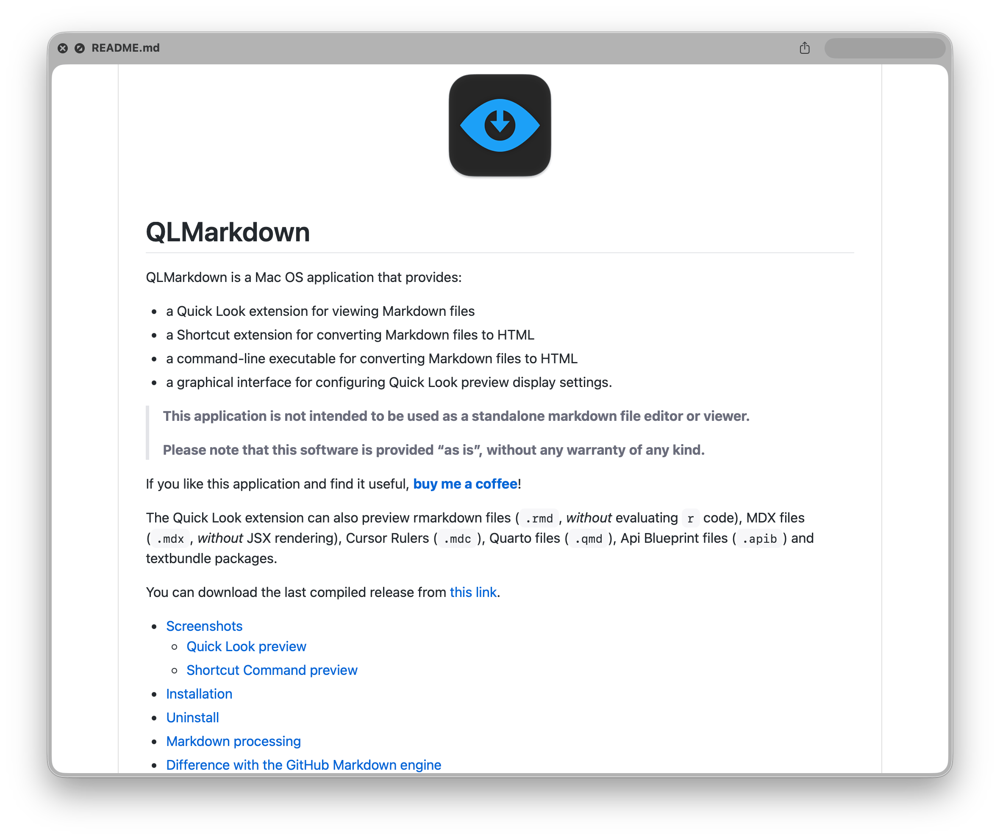
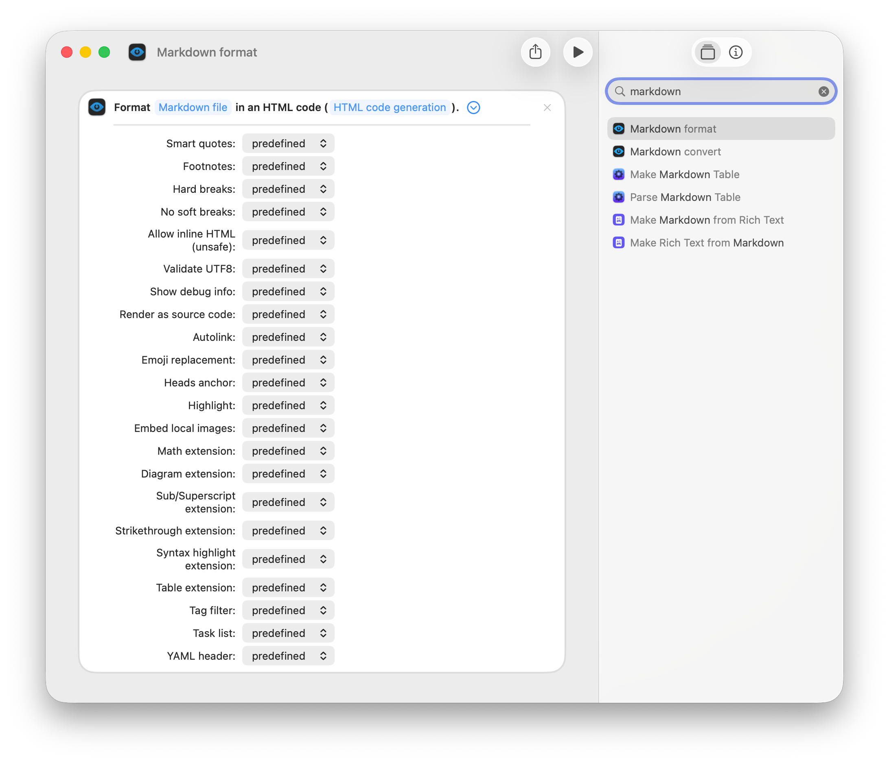
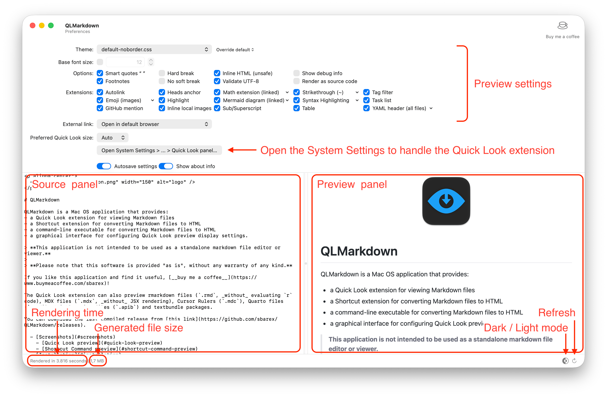
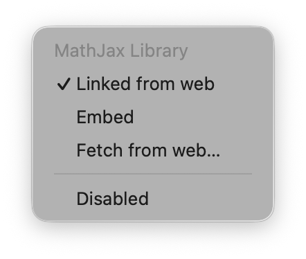
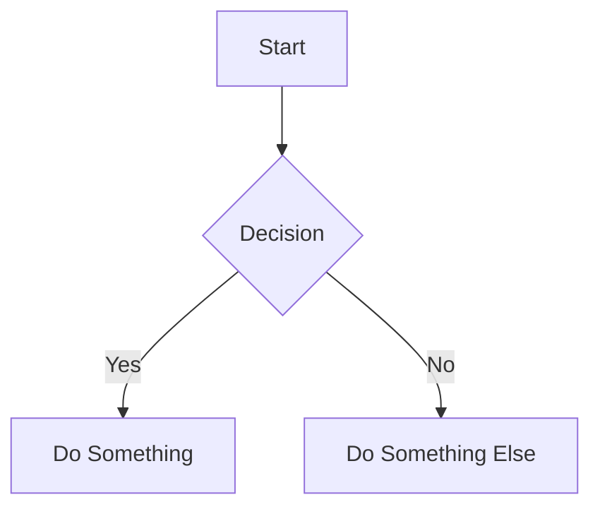
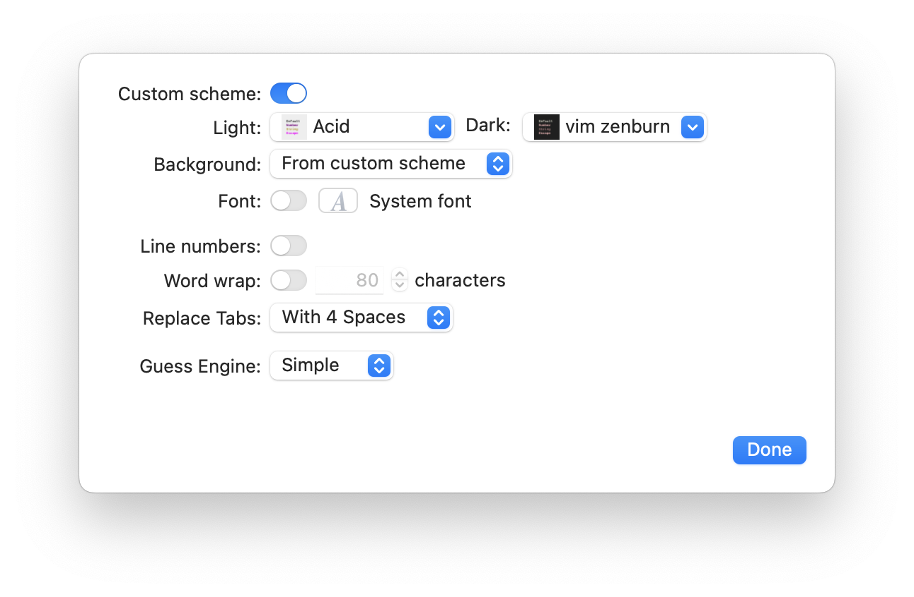
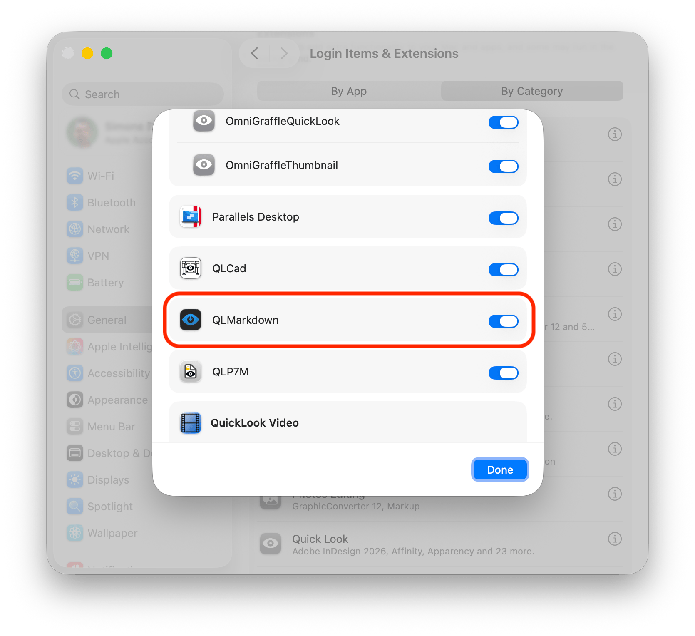

[](https://github.com/sbarex/QLMarkdown/releases) [](https://github.com/sbarex/QLMarkdown/releases)

[](https://www.buymeacoffee.com/sbarex)

<p align="center">
  
</p>

# QLMarkdown

QLMarkdown is a Mac OS application that provides:
- a Quick Look extension for viewing Markdown files
- a Shortcut extension for converting Markdown files to HTML
- a command-line executable for converting Markdown files to HTML
- a graphical interface for configuring Quick Look preview display settings. 

> **This application is not intended to be used as a standalone markdown file editor or viewer.**
>
> **Please note that this software is provided "as is", without any warranty of any kind.**

If you like this application and find it useful, [__buy me a coffee__](https://www.buymeacoffee.com/sbarex)!

The Quick Look extension can also preview rmarkdown files (`.rmd`, _without_ evaluating `r` code), MDX files (`.mdx`, _without_ JSX rendering), Cursor Rulers (`.mdc`), Quarto files (`.qmd`), Api Blueprint files (`.apib`) and textbundle packages.

You can download the last compiled release from [this link](https://github.com/sbarex/QLMarkdown/releases). 

  - [Screenshots](#screenshots)
    - [Quick Look preview](#quick-look-preview)
    - [Shortcut Command preview](#shortcut-command-preview)
  - [Installation](#installation)
  - [Uninstall](#uninstall)
  - [Markdown processing](#markdown-processing)
  - [Difference with the GitHub Markdown engine](#difference-with-the-github-markdown-engine)
  - [Quick Look Settings](#quick-look-settings)
    - [Themes](#themes)
    - [Options](#options)
    - [Extensions](#extensions)
      - [Emoji](#emoji)
      - [Inline local images](#inline-local-images)
      - [Mathematical expressions](#mathematical-expressions)
      - [Mermaid diagrams](#mermaid-diagrams)
      - [Syntax Highlighting](#syntax-highlighting)
      - [YAML header](#yaml-header)
  - [Command line interface](#command-line-interface)
  - [Shortcut Commands](#shortcut-commands)
  - [Build from source](#build-from-source)
    - [Dependency](#dependency)
  - [FAQ](#faq)
  - [Note about security](#note-about-security)
  - [Note about the developer](#note-about-the-developer)


## Screenshots


### Quick Look preview




### Shortcut Command preview




## Installation

You can download the last compiled release from [this link](https://github.com/sbarex/QLMarkdown/releases) or you can install with [Homebrew](https://brew.sh/):   

```shell
brew install --cask qlmarkdown
```

_The precompiled app is notarized and signed_.

**You must launch the application at least once**. In this way the Quick Look extension will be discovered by the system and some shared files are installed for the Shortcut extension. 
After the first execution, the Quick Look extension will be available (and enabled) among those present in the System preferences/Extensions.


## Uninstall

To install the application, simply drag it to the trash.
Support files can be deleted by removing the folder `~/Library/Group Containers/group.org.sbarex.qlmarkdown`.


## Markdown processing

For maximum compatibility with the Markdown format, the [`cmark-gfm`](https://github.com/github/cmark-gfm) library is used. The library is a GitHub fork of the standard cmark tool to [process the Markdown files](https://github.github.com/gfm/). 

Compared to the `cmark-gfm`, these extensions have been added:
- [`Emoji`](#emoji): translate the emoji shortcodes like `:smile:` to :smile:.
- [`Heads anchors`](#heads-anchors): create anchors for the heads.
- `Highlight`: highlight the text contained between the markers `==`.
- [`Inline local images`](#inline-local-images): embed the image files inside the formatted output (required for the Quick Look preview).
- `Subscript`: subscript text between the markers `~`.
- `Superscript`: superscript text between the markers `^`.
- [`Math`](#mathematical-expressions): format the mathematical expressions with the MathJax library.
- [`Mermaid`](#mermaid-diagrams): render the diagrams with the Mermaid library.
- [`Syntax highlighting`](#syntax-highlighting): highlight the code inside fenced block.
- [`YAML header`](#yaml-header): render the yaml header at the begin of `rmd` or `qmd` files.


## Difference with the GitHub Markdown engine

Although GitHub has customized the [`cmark-gfm`](https://github.com/github/cmark-gfm) library, it does not use it directly in the rendering process of Markdown files (see [this repository](https://github.com/github/markup)).
GitHub uses a number of libraries in Ruby for parsing and formatting source code that cannot easily be converted into a compiled library.

The main difference between this application and GitHub is the formatting of the source code.
Syntax highlighting uses a different library, so the formatting, colors scheme, and language token recognition are potentially different.


## Quick Look Settings

Launching the application, you can configure the options, enable the desired extensions and set the theme for formatting the Quick Look preview of Markdown files.

__To make the settings effective you need to save them (`cmd-s` or menu `File` > `Save settings`) or enable the autosave option.__



The window interface has an inline editor to test the settings with a markdown file. You can open a custom markdown file and export the edited source code.

> Please note that **this application is not intended to be used as a standalone markdown file editor or viewer** but only to set Quick Look preview formatting preferences. 


### Themes

You can choose a CSS theme to render the Markdown file. The application is provided with a predefined theme derived from the GitHub style valid both for light and dark appearance. 

You can also use a style to extend the standard theme or to override it. 
User customized style sheet must have the settings for both light and dark appearance using the CSS media query:

```css
@media (prefers-color-scheme: dark) { 
    /* … */ 
}
``` 

The custom style is appended after the CSS used for the highlight the source code. In this way you can customize also the style of the syntax highlight. 

The theme popup menu has some extra commands available pressing the `alt` key.

It is possibile to set a custom base font size. This size (in points) will be used for set the dimension of `1rem` in the css style sheet.


### Options

|Option|Description|
|:--|:--|
|Smart quotes|Convert straight quotes to curly, ```---``` to _em dashes_ and ```--``` to _en dashes_.|
|Footnotes|Parse the footnotes. |
|Hard break|Render `softbreak` elements as hard line breaks.|
|No soft break|Render `softbreak` elements as spaces.|
|Inline HTML (unsafe)|Render raw HTML and unsafe links (`javascript:`, `vbscript:`,  `file:` and `data:`, except for `image/png`, `image/gif`,  `image/jpeg`, or `image/webp` mime types) present in the Markdown file. By default, HTML tags are stripped and unsafe links are replaced by empty strings. _This option is required for preview SVG images_.|
|Validate UTF|Validate UTF-8 in the input before parsing, replacing illegal sequences with the standard replacement character (U+FFFD &#xFFFD;).|
|Show about info|Insert a footer with info about the QLMarkdown app.|
|Show debug info|Insert in the output some debug information.|
|Render as source code|Show the plain text file (raw version) instead of the formatted output. Syntax highlighting remains.|


### Extensions

|Extension|Description|
|:--|:--|
|Autolink|Automatically translate URL to link and parse email addresses.|
|Emoji|Enable the [Emoji extension](#emoji).|
|GitHub mentions|Translate mentions to link to the GitHub account.|
|<a name="heads-anchors"></a>Heads anchors|Create anchors for the heads to use as cross internal reference. Each anchor is named with the lowercased caption, stripped of any punctuation marks (except the dash) and spaces replaced with dash (`-`). UTF8 character encoding is supported.|
|Highlight|Highlight the text contained between the markers `==`.|
|Inline local images|Enable the [Inline local images extension](#inline-local-images).|
|Math|Enable the [formatting of math expressions](#mathematical-expressions).|
|Mermaid|Enable the [Mermaid diagram](#mermaid-diagrams) extension.|
|Strikethrough|Strikethrough text inside tildes. You can choose to detect single or double tilde delimiters.|
|Sub/Superscript|Allow to subscript text inside `~` tag pairs, and superscript text inside `^` tag pairs. Please note that the Strikethrough extension must be disabled or set to recognize double `~`.|
|Syntax highlighting|Enable the [Syntax highlighting extension](#syntax-highlighting). |
|Table|Parse table as defined by the GitHub extension to the standard Markdown language.|
|Tag filter|Strip potentially dangerous HTML tags (`<title>`,   `<textarea>`, `<style>`,  `<xmp>`, `<iframe>`, `<noembed>`, `<noframes>`, `<script>`, `<plaintext>`). It only takes effect if the option to include HTML code is enabled.|
|Task list|Parse task list as defined by the GitHub extension to the standard Markdown language.|
|YAML header|Enable the [YAML header extension](#YAML-header).|

Tou can also choose if open external link inside the Quick Look preview window or in the default browser.

The `Quick Look window` option allow you to force a custom size for the content area of the Quick Look window. _Use with caution on macOS before version 12 Monterey_.


#### Emoji

You can enable the Emoji extension to handle the shortcodes defined by [GitHub](https://api.github.com/emojis). You can render the emoji with an emoticon glyph or using the image provided by GitHub (internet connection required). 

Multibyte emojis are supported, so `:it:` equivalent to the code `\u1f1ee\u1f1f9` must be rendered as the Italian flag :it:. 

Some emojis do not have a glyph equivalent in the standard font and will always be replaced with the corresponding image.

A list of GitHub emoji shortcodes is available [here](https://github.com/ikatyang/emoji-cheat-sheet/blob/master/README.md#people--body).

 
### Inline local images 

You can enable the Inline image extension required to preview images within the Quick Look window by injecting the images into the HTML code. The Quick Look extension, for security limitations, cannot access to the local images defined inside the Markdown code, so embedding the data it's a way around this limitation. 

For security reasons are handled only URLs without schema (e.g., `./image.jpg`, `image.jpg` or `assets/image.jpg`), or with the `file` schema (e.g.,  `file:///Users/username/Documents/image.jpg`) referring to existing files with an image mime type. 
With the `file://` schema you *must always set the full path*. For images inside the same folder of the Markdown file do not use the  `file://` schema and also the path `./` is optional.

The extension process both images defined in the Markdown syntax and also with HTML `` tag if the raw HTML code option is enabled.


#### Mathematical expressions

This extension allow to format the mathematical expressions using the LaTeX syntax like [GitHub](https://docs.github.com/en/get-started/writing-on-github/working-with-advanced-formatting/writing-mathematical-expressions).
Math rendering capability uses [MathJax](https://www.mathjax.org/) display engine.

Inline math expressions are delimited with a dollar symbol `$`. Block expressions are delimited with a double dollar symbols `$$`.

Alternatively, you can use the ` ```math ` code block syntax to display a math expression as a block.

The [MathJax](https://www.mathjax.org/) library is loaded if the markdown code contains ` ```math ` code blocks or one or more dollar sign.

You can choose to link the library from the web (internet connection required, fetched from `cdn.jsdelivr.net`) or embed the source code in the html output. 
At the first execution of the main Application a local copy of the library is downloaded and cached. You can fetch an update version from the extension poup menu.




#### Mermaid diagrams

This extension renders [Mermaid](https://mermaid.js.org/) diagrams directly in the Quick Look preview. Mermaid is a JavaScript-based diagramming and charting tool that uses Markdown-inspired text definitions.

Supported diagram types include:
- Flowcharts
- Sequence diagrams
- Class diagrams
- State diagrams
- Entity Relationship diagrams
- Pie charts
- And more...

To create a Mermaid diagram, use a fenced code block with the `mermaid` language identifier:

~~~markdown

```mermaid
graph TD
    A[Start] --> B{Decision}
    B -->|Yes| C[Do Something]
    B -->|No| D[Do Something Else]
```
~~~

You can choose to link the library from the web (require a network connection to `cdn.jsdelivr.net`) or embed the code in the html output. 
You can choose to link the library from the web (internet connection required, fetched from `cdn.jsdelivr.net`) or embed the source code in the html output. 
At the first execution of the main Application a local copy of the library is downloaded and cached. You can fetch an update version from the extension poup menu.

> **Note:** The library is initialized with `securityLevel: 'strict'` for safety.

The diagram theme automatically adapts to the system appearance (light/dark mode).


#### Syntax Highlighting

This extension highlights the source code inside a fenced box.

The rendering engine is based on the [Highlight](http://www.andre-simon.de/doku/highlight/en/highlight.php) library embedded in the app.



You can customize the settings:

- Line numbers visibility.
- Word wrap options.
- Tabs replacements.

If no language is defined for the fanced block, the code is rendered as a plain text.


### YAML header

You can enable the extension to handle a `yaml` header at the beginning of a file. You can choose to enable the extensions to all `.md` files or only for `.rmd` and `.qmd` files.

The header is recognized only if the file start with `---`. The yaml block must be closed with `---` or with `...`.

When the `table` extension is enabled, the header is rendered as a table, otherwise as a block of code. Nested tables are supported.


## Command line interface

A `qlmarkdown_cli` command line interface (CLI) is available to perform batch conversion of markdown files.

The tool is located inside the `QLMarkdown.app/Contents/Resources` folder (and should not be moved outside). 

You can create a symbolic link into `usr/local/bin` from the `QLMarkdown` menu, or manually from the Terminal app:

```sh
ln -s /Applications/QLMarkdown.app/Contents/Resources/qlmarkdown_cli /usr/local/bin/qlmarkdown_cli
```

```
OVERVIEW: Command line tool to convert markdown files to html.

Developed by SBAREX 2020 - 2026.
https://github.com/sbarex/QLMarkdown

USAGE: ql-markdown-cli [<options>] [<files> ...]

ARGUMENTS:
  <files>                 File to be processed.

MARKDOWN OPTIONS:
  --appearance <appearance>
                          (values: light, dark)
  --base-font-size <number>
                          Set the base font size, in points.
  --footnotes <on|off>    Parse the footnotes. (values: on, off)
  --hard-break <on|off>   Render softb-reak elements as hard line breaks. (values: on, off)
  --no-soft-break <on|off>
                          Render soft-break elements as spaces. (values: on, off)
  --raw-html <on|off>     Convert straight quotes to curly. (values: on, off)
  --render-as-code <on|off>
                          Show the plain text file (raw version) instead of the formatted output. (values: on, off)
  --smart-quotes <on|off> Convert straight quotes to curly. (values: on, off)
  --validate-utf8 <on|off>
                          Validate UTF-8 in the input before parsing. (values: on, off)
  --debug <on|off>        Insert in the output some debug information. (values: on, off)

MARKDOWN EXTENSIONS:
  --autolink <on|off>     Automatically translate URL/email to link. (values: on, off)
  --emoji <emoji>         Translate the emoji shortcodes.
        font              - replace with font glyphs
        images            - repolace with web images
        off               - disabled
  --github-mentions <on|off>
                          Translate mentions to link to the GitHub account (values: on, off)
  --heads-anchor <on|off> Create anchors for the heads. (values: on, off)
  --highlight <on|off>    Highlight text marked with `==`. (values: on, off)
  --inline-images <on|off>
                          Embed local image files inside the formatted output. (values: on, off)
  --math <path|url>       Format the mathematical expressions with MathJax. You can specify the path or url of the MathJax.js library.
  --math-embed <on|off>   Embed/Link the MathJax library. (values: on, off)
  --mermaid <path|url>    Format the mermaid diagrams. You can specify the path or url of the MathJax.js library.
  --mermaid-embed <on|off>
                          Embed/Link the mermaid library. (values: on, off)
  --table <on|off>        Enable table extension. (values: on, off)
  --tag-filter <on|off>   Strip potentially dangerous HTML tags. (values: on, off)
  --tasklist <on|off>     Parse task list. (values: on, off)
  --strikethrough <strikethrough>
                          Recognize single/double `~` for the strikethrough style.
        single            - detect single tilde (~)
        double            - detect double tilde (~~)
        off               - disabled
  --syntax-highlight <on|off>
                          Highlight the code inside fenced block. (values: on, off)
  --sub <on|off>          Format subscript characters inside `~` markers. (values: on, off)
  --sup <on|off>          Format superscript characters inside `^` markers. (values: on, off)
  --yaml <yaml>           Render the yaml header.
        rmd               - enabled only for .rmd and .qmd files
        all               - enabled for all files
        off               - disabled

OPTIONS:
  --help
  -o <path>               Destination output. If you pass a directory, a new file is created with the name of the processed source with .html extension. 
                          The destination file is always overwritten. If this argument is not provided, the output will be printed to the stdout.
                          To handle multiple files at time you need to pass the -o argument with a destination folder.
  -v, --verbose           Verbose mode. Valid only with the -o option.
  --app <path>            Path of the main QLMarkdown.app application.
  --show-settings         Show the customized settings and exit.
  --version               Show the version.
  -h, --help              Show help information.
```

> **Note:** the CLI interface do not share the settings with the main Application or the Quick Look extension. 

Any relative paths inside raw HTML fragments are not updated according to the destination folder. 


## Shortcut Commands

The application provides two commands for the `Shortcuts` Application:
- `Markdown format`: format a markdown file and output the converted html code. 
- `Markdown convert`: format a markdown file and save the converted html code to a file.


## Build from source

When you clone this repository, remember to fetch also the submodule with `git submodule update --init`.

Some libraries (`Sparkle`, `Yams` and `SwiftSoup`) are handled by the Swift Package Manager. In case of problems it might be useful to reset the cache with the command from the menu `File/Packages/Reset Package Caches`.


### Dependency

The app uses the following libraries:
- [`highlight`](http://www.andre-simon.de/doku/highlight/en/highlight.php) for syntax highlighting.
- [`PCRE2`](https://github.com/PhilipHazel/pcre2) and [`JPCRE2`](https://github.com/jpcre2/jpcre2) used by the heads extension.
- [MathJax](https://www.mathjax.org/) for mathematical expressions rendering.
- [Mermaid](https://mermaid.js.org/) for diagrams rendering.

`libpcre` require the `autoconf` utility to be build. You can install it with [`homebrew`](https://brew.sh/):

```sh
brew install autoconf
``` 

The compilation of `cmark-gfm` require `cmake` (`brew install cmake`). 


## Note about security

** This application does not collect any information about your system or the files it processes.**

To allow the Quick Look view of local images the application and the extension has an entitlement exception to allow *only read access* to the entire system. 

On macOS 11 (Big Sur) there is a bug in the Quick Look engine and WebKit that cause the immediate crash of any WebView inside a Quick Look preview. To temporary fix this problem this Quick Look extension uses a `com.apple.security.temporary-exception.mach-lookup.global-name` entitlement. 


## FAQ

> The Quick Look preview do not works
There could be many reasons why the preview isn't working.

First, check that QLMarkdown is enabled in `System Settings` > `General` > `Login Items & Extensions` > `Quick Look`.



If the application doesn't appear in the list, try dragging it to the Trash, then briefly dragging it back to the Applications folder and launching it. This may force the extension to be automatically recognized.

If the QLMarkdown Quick Look Extension is present (and checked) in the list but the `.md` files are not displayed it is probably due to other applications that have registered support for that type of file. 
From the `System Settings` > `General` > `Login Items & Extensions` > `Quick Look`, try disabling all Quick Look extensions except QLMarkdown and see if the preview works. If so, re-enable the Quick Look extensions of the other applications one at a time until you find the one causing the conflict.

If it still doesn't work, it might be because of how other applications have redefined the markdown format (UTI). 

In the Terminal try the following command:

```shell
touch /tmp/qlmarkdown.md && mdls -name kMDItemContentType /tmp/qlmarkdown.md && rm /tmp/qlmarkdown.md
```

The output is the UTI associated with the `.md` file.

This application handle these UTIs:
- `public.markdown`
- `com.rstudio.rmarkdown`
- `com.unknown.md`
- `io.typora.markdown`
- `net.daringfireball.markdown`
- `net.ia.markdown`
- `org.apiblueprint.file`
- `org.quarto.qmarkdown`
- `org.textbundle.package`
- `com.nutstore.down`
- `dyn.ah62d4rv4ge8043a` (dynamic UTI for unassociated .md files)
- `dyn.ah62d4rv4ge81e5pe` (dynamic UTI for unassociated .rmd files)
- `dyn.ah62d4rv4ge81c5pe` (dynamic UTI for unassociated .qmd files)
- `dyn.ah62d4rv4ge80c6dmqk` (dynamic UTI for unassociated .apib files)

**Please inform me of any other UTI associated to `.md` files.**

---

> QLMarkdown doesn't appear in the list of applications that can open a Markdown file (for example, from the `Open With…` menu)

> Double-clicking the file doesn't open QLMarkdown

This is a desired behavior. QLMarkdown is not intended to be used as a standalone markdown file editor or viewer.


## Note about the developer

I am not primarily an application developer. There may be possible bugs in the code, be patient.
Also, I am not a native English speaker :sweat_smile:. 

Thanks to [setanarut](https://github.com/setanarut) for the app icon and the CSS style.

**This application was developed for pleasure :heart:.**

If you find this application useful, [__buy me a coffee!__](https://www.buymeacoffee.com/sbarex)
